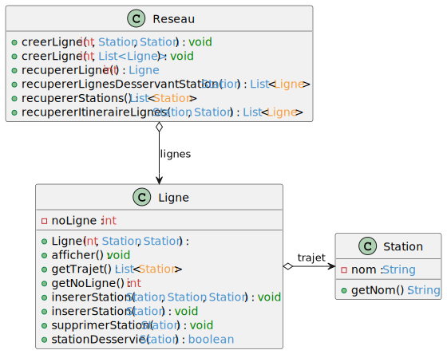

# TP2

# Informations
Nom : REHUA
Prénom : Manuvai

Lien vers le dépôt Github : https://github.com/manuvai/M2_MIAGE_IPM_POO_TP2

# Diagramme de classes

# Services de l'application
## Définition du service
L'utilisation des services est faite dans la classe `Main` 

## Tests et validation
Les tests unitaires sont définis dans le package `tests.res`

# Note
Pour l'instant la recherche des lignes désservant d'un point A à un point B ne contient pas tous les trajets.
Mais comme piste, il serait possible de remanier le schéma de classe afin d'avoir un lien réciproque entre Station et Ligne pour utiliser la récurrence.

